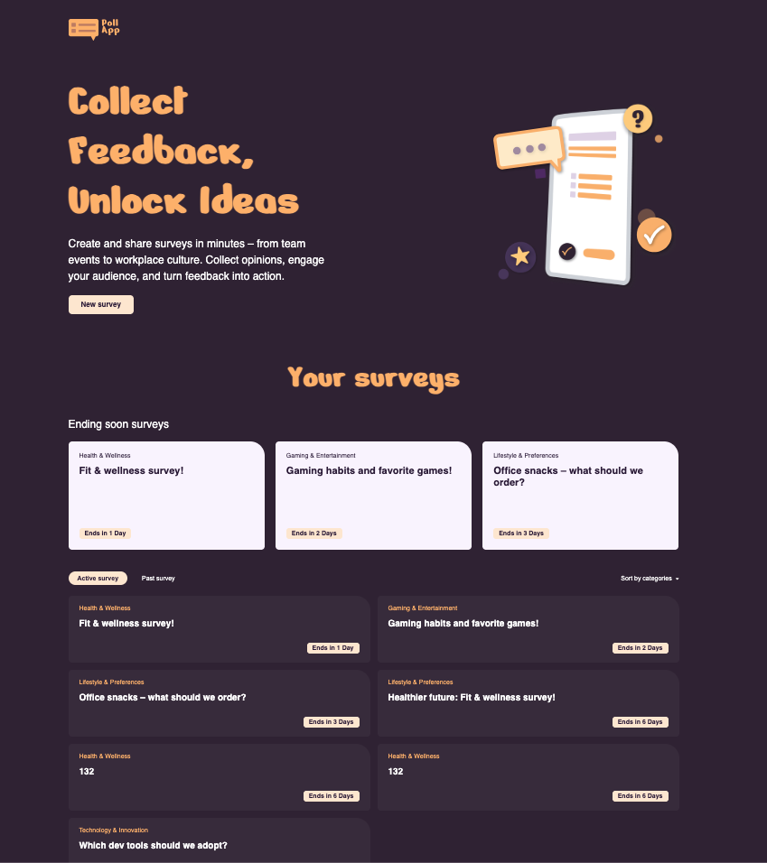
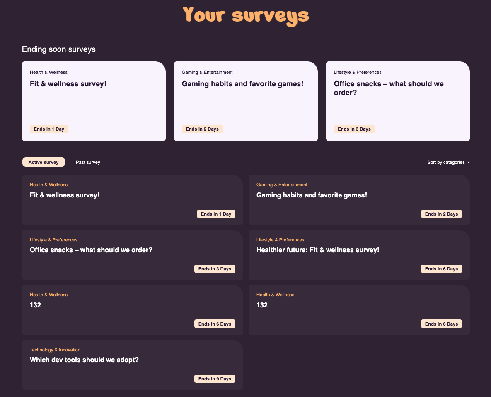
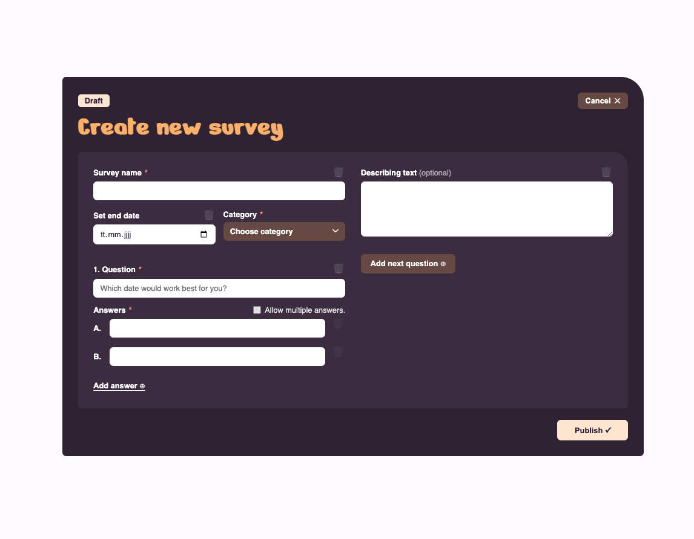
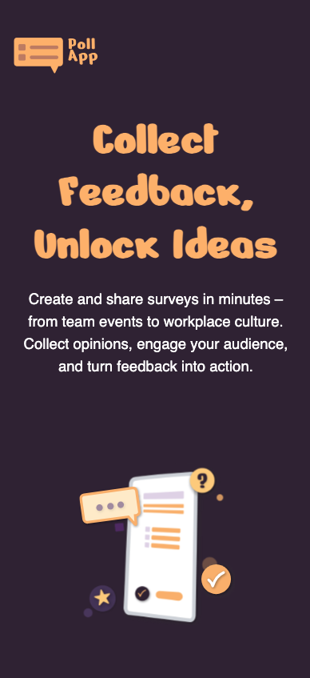
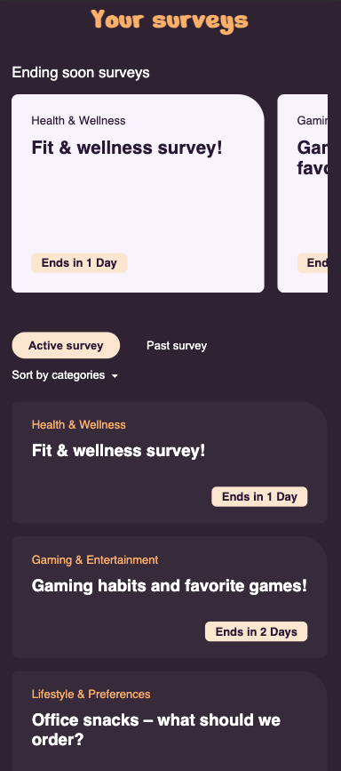
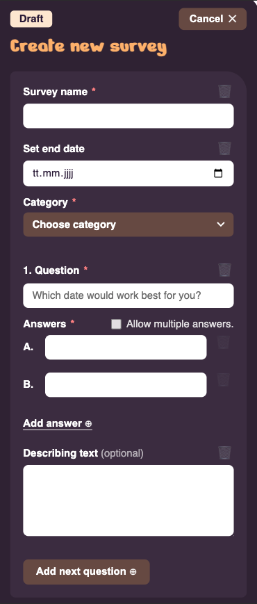

<div align="center">

# 📊 Poll App

### Collect Feedback, Unlock Ideas

**Eine moderne Survey- & Voting-App, gebaut mit Angular 21 und Supabase**

[](https://angular.dev)
[](https://www.typescriptlang.org/)
[](https://supabase.com)
[](https://sass-lang.com)

[🌐 Live Demo](http://poll-app.bajo-dev.ch/) · [📖 Features](#-features) · [🚀 Setup](#-installation) · [📚 Architektur](#-projekt-architektur)

</div>

---

## 📸 Screenshots


### 🏠 Home – Übersicht aller Umfragen



### 📋 Detail – Abstimmen mit Live-Auswertung



### ➕ Create – Neue Umfrage erstellen



### 📱 Mobile View
<table>
  <tr>
    <td></td>
    <td></td>
    <td></td>
  </tr>
</table>

---

## 🎯 Über das Projekt

Eine Single-Page-Application zum Erstellen, Teilen und Beantworten von Umfragen. Entwickelt als erstes Angular-Projekt im Rahmen der Developer Akademie.

**🌐 Live Demo:** [http://poll-app.bajo-dev.ch/](http://poll-app.bajo-dev.ch/)

### ✨ Features

- 📝 **Umfragen erstellen** – mit dynamischer Anzahl an Fragen und Antworten
- 🗳 **Single- oder Multiple-Choice** Fragen festlegen
- 📊 **Live-Auswertung** mit Balkendiagrammen während der Abstimmung
- ⏰ **Ending Soon** – bald endende Umfragen werden hervorgehoben
- 🏷 **6 Kategorien** zur Organisation (Team activities, Health & Wellness, Gaming, etc.)
- 🔍 **Filter** nach Kategorie + Tabs für Active/Past Surveys
- 📅 **Enddatum** – abgelaufene Umfragen sind nicht mehr klickbar
- 📱 **Responsive Design** – funktioniert auf Desktop, Tablet und Mobile
- ⚡ **Loading- und Error-States** für bessere UX
- 🌐 **Cloud-Datenbank** – Daten werden in Supabase gespeichert

---

## 🛠 Tech-Stack

| Layer | Technologie | Warum? |
|---|---|---|
| **Framework** | Angular 21 | Modernste Version mit Signals, Standalone Components |
| **Sprache** | TypeScript | Type Safety, gute IDE-Unterstützung |
| **State** | Angular Signals | Reaktiv, modern, einfach zu verstehen |
| **Forms** | Reactive Forms + FormArray | Dynamische Formulare mit Validierung |
| **Routing** | Angular Router (Lazy Loading) | Schnellerer Initial Load |
| **Styling** | SCSS (BEM-Style) | Wartbar, klare Klassennamen |
| **Backend** | [Supabase](https://supabase.com) (Postgres) | Backend-as-a-Service, kostenlos für Demos |
| **Hosting** | [Green.ch](https://www.green.ch) (Apache) | Schweizer Webhosting |

---

## 📁 Projekt-Architektur

```
src/app/
├── core/                          # App-weite Services & Models
│   ├── models/
│   │   └── survey.model.ts        # TypeScript Interfaces
│   └── services/
│       ├── supabase.ts            # Supabase Client (Singleton)
│       └── survey.service.ts      # CRUD & State Management
│
├── shared/                        # Wiederverwendbare Components
│   └── components/
│       ├── header/                # Logo + Navigation
│       ├── survey-card/           # Survey-Karte (2 Varianten)
│       ├── survey-results/        # Live-Balkendiagramm
│       └── loading-spinner/       # Wiederverwendbarer Spinner
│
├── features/                      # Hauptseiten (= Routen)
│   ├── home/                      # Übersicht aller Surveys
│   ├── survey-detail/             # Survey öffnen + abstimmen
│   └── create-survey/             # Neue Survey erstellen
│
├── app.component.*                # Wrapper (Header + Router-Outlet)
├── app.routes.ts                  # Routen mit Lazy Loading
└── app.config.ts                  # App-Konfiguration
```

### Datenmodell

```typescript
Survey ──< Question ──< Answer
   │           │           │
   │           │           └── { id, text, votes }
   │           └── { id, text, allowMultiple, answers[] }
   └── { id, title, category, endDate, questions[] }
```

---

## 🚀 Installation

### Voraussetzungen

- [Node.js](https://nodejs.org/) (v18+)
- [Angular CLI](https://angular.dev/tools/cli) (`npm install -g @angular/cli`)
- Ein kostenloses [Supabase](https://supabase.com)-Konto mit einem eigenen Projekt

> **Hinweis:** Die App speichert alle Daten extern in einer **Supabase-Datenbank** (PostgreSQL).  
> Ohne eine eigene Supabase-Instanz läuft die App zwar, kann aber keine Daten laden oder speichern.

### 1. Repository klonen

```bash
git clone https://github.com/dein-username/poll-app.git
cd poll-app/poll-app
npm install
```

### 2. Supabase-Zugangsdaten eintragen

Die App benötigt eine eigene Supabase-Instanz. Trage deine **Project URL** und deinen **anon public API Key** in die Environment-Dateien ein:

- `src/environments/environment.development.ts` (lokale Entwicklung)
- `src/environments/environment.ts` (Produktions-Build)

> URL und API Key findest du in deinem Supabase-Dashboard unter:  
> **Project Settings → API → Project URL & Project API Keys (anon public)**

### 3. Datenbankschema einrichten

Erstelle in Supabase (SQL Editor) folgende Tabellen:

```sql
create table surveys (
  id          uuid primary key default gen_random_uuid(),
  title       text not null,
  description text,
  category    text not null,
  end_date    timestamptz,
  created_at  timestamptz default now(),
  status      text default 'published'
);

create table questions (
  id         uuid primary key default gen_random_uuid(),
  survey_id  uuid references surveys(id) on delete cascade,
  text       text not null,
  allow_multiple boolean default false,
  position   int default 0
);

create table answers (
  id          uuid primary key default gen_random_uuid(),
  question_id uuid references questions(id) on delete cascade,
  text        text not null,
  votes       int default 0,
  position    int default 0
);
```

### 4. Dev-Server starten

```bash
ng serve
```

Die App ist anschliessend unter `http://localhost:4200` erreichbar.

---

## ✅ User Stories

Alle 5 User Stories aus der Anforderung erfüllt:

| # | Story | Status |
|---|---|---|
| 1 | Bald endende Umfragen erkennen | ✅ "Ending Soon" Sektion oben |
| 2 | Übersichtliche Liste aller Umfragen | ✅ Karten mit Tabs (Active/Past) + Filter |
| 3 | Neue Umfrage erstellen | ✅ Validierung, dynamische Fragen/Antworten |
| 4 | Umfrage öffnen + abstimmen | ✅ Detail-Seite, abgelaufene nicht klickbar |
| 5 | Live-Auswertung sehen | ✅ Balkendiagramm rechts neben Abstimmung |

---

## 🎨 Design System

Das Design basiert auf dem eigenen Figma-Entwurf mit folgenden Eckdaten:

```scss
:root {
  --color-bg:      #2D1B3D;   /* Hintergrund (dunkles Lila) */
  --color-surface: #F5EFE7;   /* helle Karten */
  --color-primary: #F4A663;   /* Orange (Akzent) */
  --color-accent:  #FFD9A3;   /* helleres Orange */
  --color-text-light: #FFFFFF;
  --color-text-dark:  #2D1B3D;
}
```

**Typografie:** Custom Brand Font für Headlines (orange), Inter für Body.

**Mobile Breakpoint:** `< 835px` – darunter wechselt das Layout zu mobil-optimierter Darstellung mit horizontalem Snap-Slider für die "Ending Soon" Karten.

---

## 🧠 Verwendete Konzepte

Highlights der modernen Angular-Patterns, die in diesem Projekt zum Einsatz kommen:

- ⚡ **Signals** als reaktives State-Management
- 🧮 **Computed Signals** für abgeleitete Werte (z.B. `endingSoonSurveys`)
- 📦 **Standalone Components** statt NgModules
- 🚦 **Neuer Control Flow** (`@if`, `@for`, `@else`)
- 💤 **Lazy Loading** der Routes
- 📝 **Reactive Forms** mit dynamischem `FormArray`
- ⏳ **Async/Await** für Datenbank-Aufrufe
- 🛡 **Row Level Security** in Supabase

---

## 👤 Autor

Entwickelt mit ❤️ von **[Joannis Ballos]**

- 🌐 Portfolio: [www.bajo-dev.ch](http://www.bajo-dev.ch)
- 💼 LinkedIn: [Dein LinkedIn-Profil](#)
- 📧 Kontakt: [deine@email.ch](mailto:deine@email.ch)

---

<div align="center">

**⭐ Wenn dir das Projekt gefällt, freue ich mich über einen Star! ⭐**

</div>
